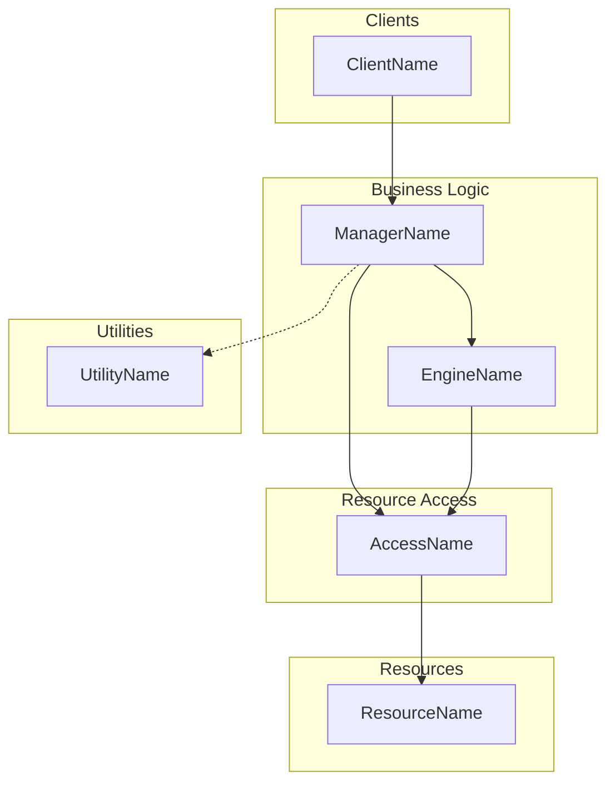
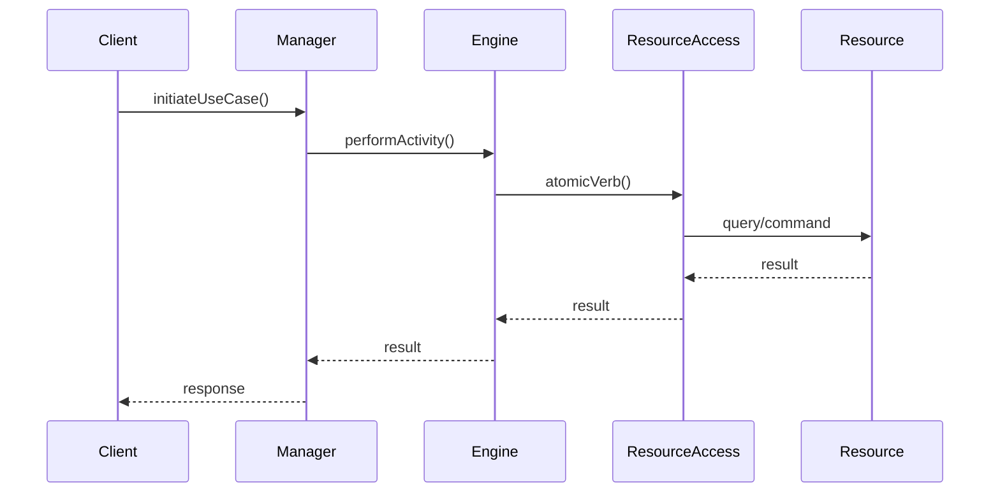

# Architecture Diagram Generation

**Read** `${CLAUDE_PLUGIN_ROOT}/references/composition.md` §5 (Call Chain Notation) and `${CLAUDE_PLUGIN_ROOT}/references/structure.md` §1
(The Four Layers) before generating diagrams.

You are producing visual representations of Löwy-style layered architectures.

## Diagram Types

### 1. Layered Architecture Overview
Shows all services organized by layer with the Utilities bar.

**Format:** Mermaid block diagram or ASCII.
**Layer colors (when supported):**
- Client layer: green
- Manager/Engine (Business Logic): yellow/amber
- ResourceAccess: gray
- Resource: blue
- Utility: purple

### 2. Call Chain Diagram
A simplified dependency graph superimposed on the layered architecture for a single use case.

**Notation:**
- `→` Solid arrow = synchronous request/response
- `⇢` or `-.->` Dashed arrow = queued/asynchronous call (through queue or message bus)
- Components colored by layer

**Mermaid template:**

### 3. Sequence Diagram
UML-style with layer-colored lifelines. Use when:
- Call ordering matters
- Multiple interactions with the same component type
- Complex use cases
- Technical audience

**Mermaid template:**

### 4. Swim Lane Activity Diagram
Use BEFORE drawing call chains to identify which services participate and how workflow
distributes across areas of interest. Each swim lane = one subsystem or area of concern.

## Workflow

### Step 1: Determine Diagram Type
Ask the user (or infer from context):
- Overview of the full architecture → Layered Architecture Overview
- How a specific use case flows → Call Chain or Sequence Diagram
- Pre-analysis of workflow distribution → Swim Lane

### Step 2: Gather Inputs
- The list of services and their layer assignments
- The use case(s) to diagram (for call chains / sequences)
- Any known communication patterns (sync, queued, pub/sub)

### Step 3: Generate the Diagram
- Use Mermaid syntax for portability
- Enforce layer ordering top-to-bottom: Client → Manager → Engine → RA → Resource
- Utilities in a separate group (accessible from any layer)
- Validate every arrow against closed-architecture rules before rendering

### Step 4: Annotate
Add notes for:
- Which relaxed rules are in play (e.g., Manager→RA skip)
- Any queued/async boundaries
- Event publications (dashed lines with «event» label)

## Validation Before Output
Before presenting any diagram, verify:
- [ ] No upward arrows (no calling up)
- [ ] No sideways arrows within a layer (except permitted relaxations)
- [ ] Manager is the orchestrator, not the Client
- [ ] Events published only by Managers (a Client may only post a use-case request to one Manager)
- [ ] Queued calls shown as dashed arrows
